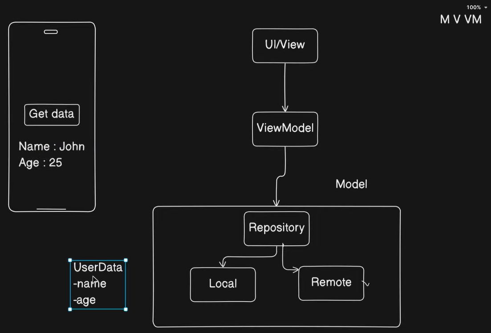

# Kotlin MVVM ex1 Get Local Data

## Table of contents

- [Architecture](#architecture)
- [Steps](#steps)
- [Resources](#resources)

## Architecture

  

## Steps

- Create packages and files.
    - model
        - UserData (data class)
        - UserRepository (class)
    - view
        - HomePage (file)
    - viewmodel
        - HomeViewModel (class)

## Resources

- YouTube
    - [Simple MVVM App 🔥 | Android | Jetpack Compose](https://www.youtube.com/watch?v=9eIhMFTs1Q8&ab_channel=EasyTuto)
